# 🛡️ Jenseiroku — Work Breakdown Structure (WBS)

This document outlines the hierarchical decomposition of the total scope of work required to build, test, and deploy **Jenseiroku** (also referred to as **LifeOS**). The project is structured into **8 major deliverables (Level 2)**, which are further decomposed into **Work Packages (Level 3)** and **Tasks (Level 4)**.

---

## 🗺️ WBS Visual Tree Diagram

The diagram below represents the high-level hierarchy of the Jenseiroku project:

```mermaid
graph TD
    classDef default fill:#12131a,stroke:#22232f,color:#e2e4ea;
    classDef main fill:#7c6aef,stroke:#9b8df7,color:#fff,font-weight:bold;
    classDef phase fill:#1a1b25,stroke:#7c6aef,color:#f0f2f5,font-weight:bold;
    classDef pkg fill:#22232f,stroke:#8b8fa3,color:#e2e4ea;

    Root[🛡️ Jenseiroku Project]:::main
    
    %% Level 2 Phases
    FND[1. Foundation & Architecture]:::phase
    ATH[2. Auth & Identity]:::phase
    VLT[3. Encrypted Vault]:::phase
    CAP[4. Quick Capture Inbox]:::phase
    ADM[5. Life Admin Trackers]:::phase
    REM[6. Reminders Engine]:::phase
    POL[7. Responsive UI & Polish]:::phase
    OPS[8. DevOps & Deployment]:::phase

    Root --> FND
    Root --> ATH
    Root --> VLT
    Root --> CAP
    Root --> ADM
    Root --> REM
    Root --> POL
    Root --> OPS

    %% Level 3 Packages for Foundation
    FND --> FND_1[1.1 Monorepo Setup]:::pkg
    FND --> FND_2[1.2 Spring Boot Core]:::pkg
    FND --> FND_3[1.3 Angular Skeleton]:::pkg
    FND --> FND_4[1.4 Flyway Migrations]:::pkg

    %% Level 3 Packages for Auth
    ATH --> ATH_1[2.1 User Reg & Password Security]:::pkg
    ATH --> ATH_2[2.2 JWT Session Mgmt]:::pkg
    ATH --> ATH_3[2.3 Zero-Knowledge Recovery Keys]:::pkg

    %% Level 3 Packages for Vault
    VLT --> VLT_1[3.1 Browser Crypto Engine]:::pkg
    VLT --> VLT_2[3.2 Envelope Encryption Pipeline]:::pkg
    VLT --> VLT_3[3.3 S3/MinIO Integration]:::pkg
    VLT --> VLT_4[3.4 Decryption & In-Memory Preview]:::pkg

    %% Level 3 Packages for Inbox
    CAP --> CAP_1[4.1 Inbox Data Intake APIs]:::pkg
    CAP --> CAP_2[4.2 Low-Friction Intake UI]:::pkg
    CAP --> CAP_3[4.3 Triage Processing Engine]:::pkg

    %% Level 3 Packages for Admin Trackers
    ADM --> ADM_1[5.1 Subscription Tracker]:::pkg
    ADM --> ADM_2[5.2 Tasks & Life Maintenance]:::pkg
    ADM --> ADM_3[5.3 Life Timeline Event Logging]:::pkg

    %% Level 3 Packages for Reminders
    REM --> REM_1[6.1 Smart Reminders Engine]:::pkg
    REM --> REM_2[6.2 Scheduler & Polling Daemon]:::pkg
    REM --> REM_3[6.3 In-App Notification Center]:::pkg
```

---

## 🗂️ Detailed WBS Dictionary

### 1. Foundation & Architecture (FND)
This phase establishes the repository structure, configures the technology stacks, and coordinates shared database layers.

| WBS Code | Work Package | Description | Deliverables | Est. Effort |
| :--- | :--- | :--- | :--- | :---: |
| **FND.1** | **Development Monorepo Setup** | Structure the project folders containing backend api and frontend web sub-projects. Configure developer settings and git config. | Workspace monorepo root config, global `.gitignore`. | 2 hrs |
| **FND.2** | **Spring Boot Core Setup** | Initialize Spring Boot 3.x project with required dependencies (Web, Security, Data JPA, PostgreSQL Driver, Validation, Lombok). Setup YAML profile configurations. | `jenseiroku-api/` starter code, global RestController advice skeleton. | 4 hrs |
| **FND.3** | **Angular Web Setup** | Initialize Angular 18+ standalone project. Set up routing, custom Tailwind/SCSS base styles, core/shared directories, and Material module integration. | `jenseiroku-web/` starter code, global layout styling, module routes. | 4 hrs |
| **FND.4** | **DB Migration System** | Configure Flyway database migration tools on the backend. Create the initial SQL schemas matching the PostgreSQL domain model. | Flyway configuration, baseline migrations (`V1__create_users.sql` etc.). | 4 hrs |

---

### 2. Authentication & Identity Management (ATH)
Builds the secure auth boundary, focusing on Argon2id password hashing, session lifecycle, and zero-knowledge prerequisites.

| WBS Code | Work Package | Description | Deliverables | Est. Effort |
| :--- | :--- | :--- | :--- | :---: |
| **ATH.1** | **User Registration & Security** | Implement registration API. Setup client-side generation of key derivation salt. Backend hashes password using Argon2id. | Registration endpoints, database user record, password constraints. | 4 hrs |
| **ATH.2** | **JWT Session Management** | Implement login, logout, and token rotation APIs. Issues short-lived access JWT in body, HttpOnly cookie with refresh token in database. | `AuthController`, token generation filters, session tables. | 6 hrs |
| **ATH.3** | **Zero-Knowledge Recovery Setup** | Implement generation of local recovery key upon signup. Hash and store it on backend for secondary verification. | Recovery key generation service, client-side PDF/Text recovery key export modal. | 4 hrs |
| **ATH.4** | **Route Guards & Interceptors** | Secure frontend routes and API endpoints. Create an interceptor to append JWT Bearer header and automatically handle token refreshes on 401s. | Angular `AuthGuard`, `AuthInterceptor`, interceptor error mapping. | 4 hrs |

---

### 3. Zero-Knowledge Encrypted Vault (VLT)
The core differentiator of Jenseiroku. Integrates browser cryptography with backend storage to achieve privacy-first document vaults.

| WBS Code | Work Package | Description | Deliverables | Est. Effort |
| :--- | :--- | :--- | :--- | :---: |
| **VLT.1** | **Browser Crypto Engine** | Code the JS Web Crypto API wrapper to derive KEK from password+salt (Argon2id), generate random DEKs, and perform symmetric AES-256-GCM encryption/decryption. | `CryptoService` in Angular web, client-side cryptographic functions. | 8 hrs |
| **VLT.2** | **Envelope Encryption Pipeline** | Define envelope encryption scheme: Encrypt file using DEK -> Wrap DEK using KEK -> Package ciphertext, IV, and wrapped DEK for API transmission. | File pre-processing upload stream, envelope mapping. | 6 hrs |
| **VLT.3** | **S3/MinIO Storage Service** | Setup MinIO client for local development and S3 SDK configuration for production storage. Build backend upload/download file handling API. | `StorageService` in Java API, multipart uploads/download streams. | 6 hrs |
| **VLT.4** | **In-Memory Preview Engine** | Implement client decryption stream. When reading files, decrypt in browser memory, and present image preview without saving unencrypted data to disk. | Image decrypt and preview container component, download blob trigger. | 6 hrs |
| **VLT.5** | **Vault Catalog UI** | Build a grid/table displaying vault documents grouped by Life Domains (Identity, Health, Legal, etc.). Support expiry input during uploads. | `VaultComponent`, category folders view, expiry calendar field. | 6 hrs |

---

### 4. Quick Capture Inbox (CAP)
Provides a universal intake gate with low friction so users can dump text notes or files on-the-fly and organize them later.

| WBS Code | Work Package | Description | Deliverables | Est. Effort |
| :--- | :--- | :--- | :--- | :---: |
| **CAP.1** | **Inbox Intake APIs** | Implement database models and REST controllers to save raw inbox items (encrypted text notes and/or raw file uploads). | `inbox_items` SQL schema, `InboxController` CRUD endpoints. | 4 hrs |
| **CAP.2** | **Quick Capture UI** | Develop a minimal intake component (input box + drag/drop upload + single-button submission) that remains accessible globally. | Quick Capture toolbar component, upload indicators, responsive grid. | 5 hrs |
| **CAP.3** | **Triage Middleware & UI** | Build the processing logic to transform an inbox item into a Vault Document, Task, Subscription, or Timeline Event. Display a slide-out options menu. | Triage dialog components, conversion API routing handlers. | 6 hrs |

---

### 5. Life Admin Trackers (ADM)
Builds the dashboards for day-to-day administration: tracking recurring billing, managing life maintenance tasks, and mapping timeline logs.

| WBS Code | Work Package | Description | Deliverables | Est. Effort |
| :--- | :--- | :--- | :--- | :---: |
| **ADM.1** | **Subscription Tracker** | Implement full CRUD for subscriptions. Tracks costs, cycles (monthly/annual), and maps linked contract PDFs stored in the Vault. | Subscription API controllers, database structures, billing sum card. | 6 hrs |
| **ADM.2** | **Unified Tasks System** | Create unified interface handling two categories: one-off To-Dos and Recurring Life Maintenance Tasks (e.g. dentist appointments, car service). | Task API, separate tabs (One-off/Recurring), templates drop-down. | 8 hrs |
| **ADM.3** | **Task Completion Engine** | Build completion logic. Mark one-off done -> updates state. Mark recurring done -> appends to completions history, calculates next due date. | Completion logging tables, recurrence date-math handlers. | 5 hrs |
| **ADM.4** | **Life Timeline** | Build a vertical, scrollable chronological timeline mapping events and major life milestones. Supports linking vault documents. | `TimelineComponent`, event logging database structure and API controllers. | 6 hrs |

---

### 6. Smart Reminders Engine (REM)
The logic layer that scans deadlines and triggers lead-time aware reminders ahead of real-world expiration dates.

| WBS Code | Work Package | Description | Deliverables | Est. Effort |
| :--- | :--- | :--- | :--- | :---: |
| **REM.1** | **Smart Reminders Core** | Backend services that monitor document expiries, task due dates, and subscription renewals. Schedules notifications based on offset matrices. | Reminders scheduling logic, notification trigger matrices. | 6 hrs |
| **REM.2** | **Scheduler Daemon** | Implement a Java `@Scheduled` background worker that executes periodically, evaluates current time against due records, and creates in-app logs. | Scheduler service loop, status update db triggers. | 4 hrs |
| **REM.3** | **In-App Alerts UI** | Build a notification bell in the top navigation bar. Includes an unread count badge, unread list drop-down, and snooze/dismiss actions. | Navigation bell component, snooze/dismiss actions panel. | 6 hrs |

---

### 7. Responsive UI & Polish (POL)
Establishes visual excellence, responsive layout control, loading states, and elegant micro-animations.

| WBS Code | Work Package | Description | Deliverables | Est. Effort |
| :--- | :--- | :--- | :--- | :---: |
| **POL.1** | **Visual Cohesion Pass** | Review styling across all views. Implement a premium dark mode, glassmorphism card panels, customized Google Fonts, and consistent button types. | `styles.scss` token configuration, updated dialog stylesheets. | 6 hrs |
| **POL.2** | **Responsive Layout Adaptations** | Code mobile-first responsive interfaces. Sidenav transitions to hamburger menu drawer on mobile view (`< 768px`), form inputs stack cleanly. | Mobile breakpoints layout, side navigation toggle service. | 6 hrs |
| **POL.3** | **Micro-animations & transitions** | Create CSS and Angular animations for page route shifts, list entry, card hover transformations, and quick capture fade-outs. | Page transition classes, list-entry animations. | 4 hrs |
| **POL.4** | **Global Errors & Notifications** | Build unified error interceptors and toast notification alerts. Standardize validation messages (`mat-error`) on forms. | Global `ErrorInterceptor`, MatSnackBar success alerts. | 4 hrs |

---

### 8. DevOps & Deployment (OPS)
Configures Docker environments, setups production relational database/object store, and launches the live web-accessible application.

| WBS Code | Work Package | Description | Deliverables | Est. Effort |
| :--- | :--- | :--- | :--- | :---: |
| **OPS.1** | **Containerization (Docker)** | Write multi-stage Dockerfiles. Backend Dockerfile: Maven compile -> JRE runner. Frontend Dockerfile: Angular build -> Nginx host. | `Dockerfile.api`, `Dockerfile.web`, root-level `docker-compose.yml`. | 4 hrs |
| **OPS.2** | **Cloud Deployment Setup** | Set up Railway/Render hosting accounts. Set up a secure cloud PostgreSQL cluster (Supabase/Neon) and S3 bucket credentials. | Environment configurations, S3 policies. | 4 hrs |
| **OPS.3** | **CI/CD Build Pipelines** | Setup GitHub Actions workflow to verify tests pass and code styles match on every repository push. | `.github/workflows/verify-ci.yml`. | 3 hrs |
| **OPS.4** | **Final System Verification** | Run final end-to-end user acceptance testing in production. Inspect console logs, network payloads, and test recovery steps. | Documented test run matrix. | 4 hrs |

---

## 📅 Summary of Estimated Effort

| Phase | Estimated Hours | Percentage |
| :--- | :---: | :---: |
| **1. Foundation & Architecture (FND)** | 14 hrs | 11.2% |
| **2. Authentication & Identity Management (ATH)** | 18 hrs | 14.4% |
| **3. Zero-Knowledge Encrypted Vault (VLT)** | 32 hrs | 25.6% |
| **4. Quick Capture Inbox (CAP)** | 15 hrs | 12.0% |
| **5. Life Admin Trackers (ADM)** | 25 hrs | 20.0% |
| **6. Smart Reminders Engine (REM)** | 16 hrs | 12.8% |
| **7. Responsive UI & Polish (POL)** | 20 hrs | 16.0% |
| **8. DevOps & Deployment (OPS)** | 15 hrs | 12.0% |
| **Total Project Scope** | **155 hrs** | **100%** |
